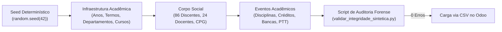

# Implementação, Contratos e Integridade

## Do Modelo Conceitual ao ORM Odoo

A implementação no paradigma Design-Driven Development não admite improvisações de sintaxe. Uma vez consolidada a especificação arquitetural, o código em Python (ORM Odoo), XML (Views e Segurança) e JavaScript (OWL) opera como uma materialização direta dos contratos pré-estabelecidos.

Nesta seção, examinamos a anatomia dos principais contratos e mecanismos de integridade desenvolvidos na suíte `l10n_br_openeducat_capes`.

## Contratos de Dados e Integridade Relacional

### 1. O Livro-Razão Append-Only de Créditos Acadêmicos

Para garantir a imutabilidade do histórico escolar e a conformidade com o princípio do ato jurídico perfeito, o modelo `op.student.credit.ledger` proíbe o descarte de linhas via método `unlink()` e exige justificativa formal para qualquer movimentação de ajuste:

```python
from odoo import models, fields, api
from odoo.exceptions import UserError, ValidationError

class OpStudentCreditLedger(models.Model):
    _name = 'op.student.credit.ledger'
    _description = 'Livro-Razão de Movimentação de Créditos Acadêmicos (Append-Only)'
    _order = 'transaction_date desc, id desc'

    student_id = fields.Many2one(
        'op.student', string='Discente', required=True, index=True, ondelete='restrict'
    )
    transaction_date = fields.Date(
        string='Data da Movimentação', default=fields.Date.context_today, required=True
    )
    movement_type = fields.Selection([
        ('coursework', 'Disciplina Regular Concluída'),
        ('transfer', 'Aproveitamento de Créditos Externos'),
        ('ptt', 'Integralização via Produção Técnica (PTT)'),
        ('adjustment', 'Ajuste Deliberado pela CPG/Congregação'),
        ('cancellation', 'Estorno de Créditos Indevidos')
    ], string='Tipo de Lançamento', required=True)

    credits_delta = fields.Float(
        string='Variação de Créditos', required=True,
        help='Valor positivo para concessão; valor negativo para estorno/ajuste.'
    )
    regulatory_justification = fields.Char(
        string='Ato Legal / Ata Deliberativa', required=True,
        help='Número da portaria ou ata da CPG que autorizou o lançamento.'
    )

    def unlink(self):
        for record in self:
            raise UserError(
                "Violação de Integridade: É estritamente vedada a exclusão física "
                "de lançamentos no Livro-Razão de Créditos. Registre um lançamento "
                "de estorno (cancellation) devidamente motivado."
            )
```

::: {.callout-note}
### Garantia de Auditoria
A interceptação do método `unlink()` assegura que nem mesmo um usuário com privilégios de administrador possa apagar registros de créditos, forçando uma trilha de auditoria contábil completa.
:::

### 2. A Trava Regulatória da Portaria CAPES 81/2016

A Portaria CAPES nº 81/2016 estabelece que um docente só pode atuar como membro permanente em no máximo 3 programas de pós-graduação *stricto sensu*. O modelo `op.faculty` aplica essa restrição através de uma constraint relacional do ORM:

```python
class OpFaculty(models.Model):
    _inherit = 'op.faculty'

    program_link_ids = fields.One2many(
        'op.faculty.program.link', 'faculty_id', string='Vínculos com Programas de Pós'
    )
    programs_summary = fields.Char(
        string='Resumo de Programas', compute='_compute_programs_summary', store=True
    )

    @api.constrains('program_link_ids')
    def _check_max_permanent_programs(self):
        for faculty in self:
            # Considera vínculos internos ativos e declarações de vínculos externos
            permanent_links = faculty.program_link_ids.filtered(
                lambda l: l.category == 'permanent' and l.is_active
            )
            if len(permanent_links) > 3:
                raise ValidationError(
                    f"Violação da Portaria CAPES 81/2016: O docente {faculty.name} "
                    f"está associado como Permanente a {len(permanent_links)} programas. "
                    "O teto legal permitido em território nacional é de no máximo 3 programas."
                )
```

## O Comutador Multiprograma: Sessão HTTP e Frontend OWL

A implementação da arquitetura multiprograma exigiu a sincronização entre a camada de persistência em Python e o frontend reativo do Odoo 19 em OWL (*Odoo Web Library*).

### Injeção no Contexto de Sessão (`ir.http`)

O método `session_info()` foi interceptado para alimentar o payload JSON entregue ao navegador:

```python
class IrHttp(models.AbstractModel):
    _inherit = 'ir.http'

    def session_info(self):
        result = super(IrHttp, self).session_info()
        user = self.env.user
        if user.has_group('base.group_user'):
            result['capes_multiprogram'] = {
                'allowed_programs': [{
                    'id': p.id,
                    'name': p.name,
                    'code': p.capes_code
                } for p in user.allowed_program_ids],
                'current_program_id': user.current_program_id.id or False,
                'is_central_admin': user.is_central_admin,
            }
        return result
```

### Componente Reativo Systray em OWL

No frontend, um componente JavaScript foi inserido na barra de utilitários superior (`Systray`), renderizando a lista suspensa de programas autorizados e disparando a ação de comutação sem recarregar o sistema inteiro:

```javascript
/** @odoo-module **/
import { Component, useState } from "@odoo/owl";
import { registry } from "@web/core/registry";
import { useService } from "@web/core/utils/hooks";

export class ProgramMenu extends Component {
    static template = "l10n_br_openeducat_capes.ProgramMenu";
    
    setup() {
        this.orm = useService("orm");
        this.action = useService("action");
        const session = odoo.session_info.capes_multiprogram || {};
        this.state = useState({
            programs: session.allowed_programs || [],
            currentProgramId: session.current_program_id || null,
        });
    }

    async onSelectProgram(programId) {
        if (programId === this.state.currentProgramId) return;
        await this.orm.call("res.users", "action_switch_program", [[], programId]);
        this.action.doAction({ type: "ir.actions.client", tag: "reload" });
    }
}

registry.category("systray").add("capes_program_menu", {
    Component: ProgramMenu,
    sequence: 50,
});
```

## Barramento de Interoperabilidade e APIs REST DAV

O submódulo `l10n_br_openeducat_capes_integration` expõe endpoints REST protegidos por autenticação Bearer Token para permitir que a Pró-Reitoria e robôs da CAPES realizem a extração de dados brutos:

```python
from odoo import http
from odoo.http import request

class DavExportController(http.Controller):

    @http.route('/api/capes/v1/dav/programs/<int:program_id>/summary', 
                type='http', auth='none', methods=['GET'], csrf=False)
    def export_program_summary(self, program_id, **kwargs):
        auth_header = request.httprequest.headers.get('Authorization')
        if not self._validate_token(auth_header):
            return request.make_response('{"error": "Unauthorized"}', status=401)
        
        program = request.env['op.program.capes'].sudo().browse(program_id)
        if not program.exists():
            return request.make_response('{"error": "Not Found"}', status=404)

        data = program._export_dav_json_payload()
        return request.make_response(
            json.dumps(data), headers=[('Content-Type', 'application/json')]
        )
```

## A Estratégia de Dados Sintéticos Determinísticos

Um dos erros mais comuns em projetos universitários é a validação de software com conjuntos de dados triviais. Quando um desenvolvedor testa um ERP com três alunos fictícios, 95% das falhas de concorrência, junções relacionais e limites regimentais permanecem ocultas.

Para validar o ecossistema, foi desenvolvido o script `scripts/gerador_dados_sinteticos.py`, que adota os seguintes princípios:



* **Determinismo Absoluto**: Uso de semente fixa (`random.seed(42)`), garantindo que os mesmos cenários de teste sejam reproduzíveis em qualquer máquina ou pipeline de Integração Contínua.
* **Cobertura Relacional Completa**: Geração de **33 entidades relacionais interconectadas**, abrangendo desde o cadastro demográfico com CPFs e ORCiDs algorítmicamente válidos até atas de reuniões mensais da Comissão de Pós-Graduação (CPG) com quórum formal.
* **Validação Forense Prévia**: Criação do script `scripts/validar_integridade_sintetica.py`, que executa a verificação prévia de todas as chaves estrangeiras e campos obrigatórios antes que qualquer arquivo CSV seja submetido ao container Odoo, garantindo índice zero de falhas na inicialização do banco.

## Matriz de Permissões e Segurança de Linha (*Record Rules*)

Para viabilizar que secretarias de departamentos distintos operem no mesmo sistema sem vazamento de informações confidenciais, foram combinados dois mecanismos:

1. **Permissões por Modelo (`ir.model.access.csv`)**: Estabelece privilégios CRUD (Create, Read, Update, Delete) com base em grupos de acesso formais:
   * *Grupo Discente*: Leitura estrita da sua própria vida acadêmica e editais públicos.
   * *Grupo Docente / Avaliador*: Acesso aos seus orientandos e às inscrições a ele distribuídas para avaliação cega.
   * *Grupo Secretaria de Programa*: Operação acadêmica no âmbito do seu programa ativo.
   * *Grupo Coordenação de PPG*: Homologação de bancas, matrículas e deliberações de CPG.
   * *Grupo Pró-Reitoria (Admin Central)*: Visão macroscópica transversal de todos os programas da IES.
2. **Segurança de Linha (*Record Rules* - `ir.rule`)**: Aplica cláusulas `WHERE` automáticas em nível de banco de dados PostgreSQL. Por exemplo, a visualização de discentes é restrita ao programa selecionado:

```xml
<record id="capes_student_program_rule" model="ir.rule">
    <field name="name">Discentes Restritos ao Programa Ativo</field>
    <field name="model_id" ref="openeducat_core.model_op_student"/>
    <field name="domain_force">
        ['|', 
            ('user_id', '=', user.id),
            ('current_program_id', '=', user.current_program_id.id)
        ]
    </field>
    <field name="groups" eval="[(4, ref('openeducat_core.group_op_back_office'))]"/>
</record>
```
